# 🎥 **IRIS: Learning-Driven Task-Specific Cinema Robot Arm for Visuomotor Motion Control**

<p align="center">
  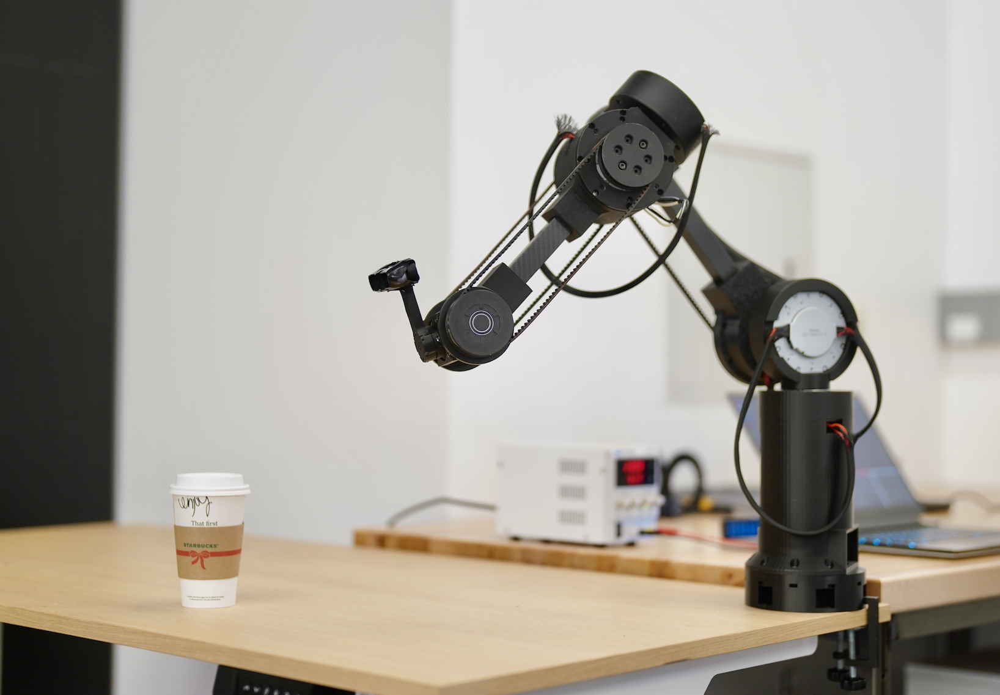
</p>
<p align="center">
  <a href="#1️⃣-hardware-platform">1️⃣ Hardware</a> •
  <a href="#2️⃣-low-level-actuator-control">2️⃣ Actuator Control</a> •
  <a href="#3️⃣-mujoco-simulation">3️⃣ MuJoCo Simulation</a> •
  <a href="#4️⃣-ros-interface-and-rosbag-collection">4️⃣ ROS + Rosbags</a> •
  <a href="#5️⃣-data-processing">5️⃣ Data Processing</a> •
  <a href="#6️⃣-imitation-learning">6️⃣ Imitation Learning</a> •
  <a href="#7️⃣-sim-to-real-deployment">7️⃣ Sim-to-Real</a>
</p>

> **IRIS (Intelligent Robotic Imaging System)** is a low-cost, 3D-printed 6-DOF cinema robot arm that learns smooth, repeatable, and obstacle-aware camera motions through visuomotor imitation learning.
> This repository contains the complete **hardware, simulation, control, ROS data collection, and learning stack**, enabling seamless **sim-to-real and real-to-sim** workflows.

<p align="center">
  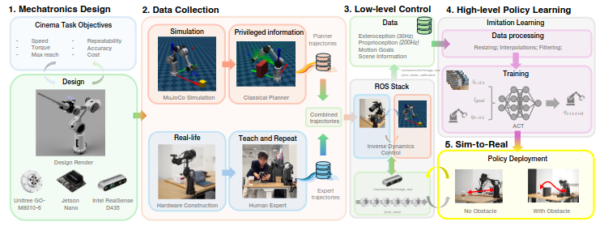
</p>

---

## 🗂 Repository Structure

```
MEng_project/
├── mujoco_sim/              # MuJoCo simulation, kinematics, planners
├── classical_planner/       # RRT*, potential-field, trajectory generation
├── mpr_control/             # Unitree actuator SDK + low-level control
├── motor_control/           # Motor diagnostics and testing
├── meng_ws/                 # ROS workspace (hardware interface, teleop, logging)
├── bag_reader/              # Rosbag recording and dataset extraction tools
├── sim2real/                # Sim–real synchronization utilities
├── il_training/             # Visuomotor imitation learning training code
├── inverse_kinematics_sim/  # Analytical and numerical IK solvers
├── paper/                   # LaTeX source for accompanying paper
└── README.md
```

---

## 1️⃣ Hardware Platform

IRIS is a **fully 3D-printed 6-DOF robotic camera arm** driven by **Unitree GO-M8010-6 torque-controlled BLDC actuators**.
The design emphasizes low cost, modularity, and high backdrivability for kinesthetic teaching.

### 🔩 3D Models and CAD

- 📐 **Mechanical CAD (STEP + STL):**
  👉 [https://github.com/thejerrycheng/IRIS-Hardware](https://github.com/thejerrycheng/IRIS-Hardware)

- 🖨️ **Printable STL files:**
  👉 [https://github.com/thejerrycheng/IRIS-Hardware/tree/main/STL](https://github.com/thejerrycheng/IRIS-Hardware/tree/main/STL)

<p align="center">
  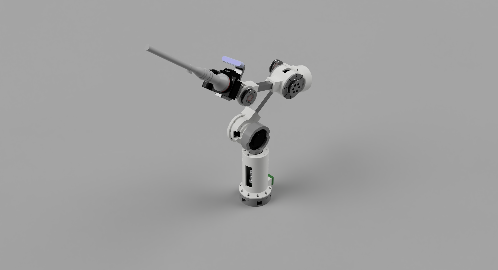
</p>

<p align="center">
  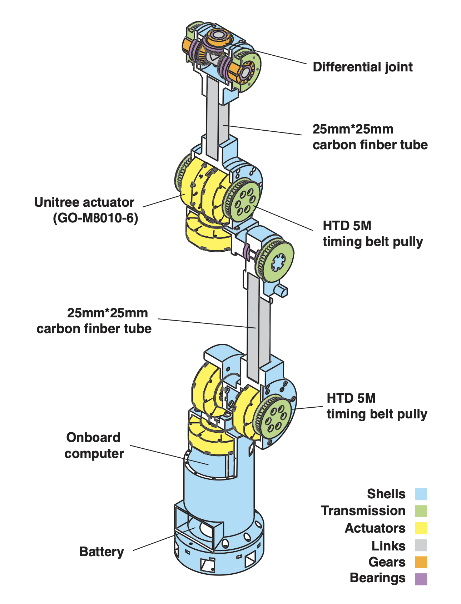
</p>

## 📦 Bill of Materials (BOM)

**Preliminary Bill of Materials (BOM) for the Cinema Robot Arm Prototype**

| Category         | Item / Spec                                                          | Qty | Unit (USD) | Link                                                                                                                                                                                                                    |
| ---------------- | -------------------------------------------------------------------- | --- | ---------- | ----------------------------------------------------------------------------------------------------------------------------------------------------------------------------------------------------------------------- |
| **Actuators**    | Unitree Go-1 Actuator                                                | 6   | $69.65     | [Taobao](https://detail.tmall.com/item.htm?app=macos_safari&bxsign=scdhoDllLzLDZuz-EHtjr8oQIfUCltxl9vCbc2FvkFQds3He_R33AMzKvX9oPeP9-9TTtP0Ol2Hx3i8Njt_08LuzTDHV1xzmhh6CO4t0s4WdWa76kEhQNE4uulwyXbIJLlv&id=679335252560) |
| **Linkages**     | Carbon fiber square tube, 25 mm width, 2 mm thickness, 500 mm length | 1   | $27.40     | [AliExpress](https://www.aliexpress.us/item/3256804047779645.html)                                                                                                                                                      |
| **Bearings**     | Deep groove bearing 26×17×5 mm (OD×ID×Depth)                         | 2   | $1.59      | [AliExpress](https://www.aliexpress.us/item/3256804434442009.html)                                                                                                                                                      |
|                  | Deep groove bearing 50×40×6 mm                                       | 6   | $2.61      | [Amazon](https://www.amazon.ca/dp/B085NDM5WV)                                                                                                                                                                           |
|                  | Deep groove bearing 42×30×7 mm                                       | 5   | $2.43      | [AliExpress](https://www.aliexpress.us/item/3256808181942791.html)                                                                                                                                                      |
| **Transmission** | HTD-5M timing belt, 150 teeth (750 mm)                               | 1   | $15.19     | [Amazon](https://www.amazon.ca/dp/B0DF57XRZ8)                                                                                                                                                                           |
|                  | HTD-5M timing belt, 160 teeth (800 mm)                               | 2   | $15.56     | [Amazon](https://www.amazon.ca/dp/B0DF4VV4L3)                                                                                                                                                                           |
| **Fasteners**    | M4 screws & nuts set                                                 | 1   | $16.69     | [Amazon](https://www.amazon.ca/dp/B06XQLTLHP)                                                                                                                                                                           |
|                  | M3.5 screws & nuts set                                               | 1   | $10.35     | [Amazon](https://www.amazon.ca/dp/B08J3XLR66)                                                                                                                                                                           |
| **Sensors**      | Intel RealSense RGB-D Camera                                         | 1   | $163.63    | [AliExpress](https://www.aliexpress.us/item/3256804447919393.html)                                                                                                                                                      |
| **Electronics**  | NVIDIA Jetson Nano                                                   | 1   | $216.15    | [AliExpress](https://www.aliexpress.us/item/3256805156846112.html)                                                                                                                                                      |
|                  | RS-485 Hub / Adapter                                                 | 1   | $0.99      | [AliExpress](https://www.aliexpress.us/item/2251832830864445.html)                                                                                                                                                      |
|                  | Main Power Supply (≥300 W)                                           | 1   | $34.97     | [AliExpress](https://www.aliexpress.us/item/2251832763824772.html)                                                                                                                                                      |
| **3D Printing**  | PLA Filament (30% infill, honeycomb interior, BambuLab)              | 1   | $16.99     | [BambuLab](https://ca.store.bambulab.com/products/pla-basic-filament)                                                                                                                                                   |
| **Misc.**        | Wire sleeving / braided loom                                         | 1   | $9.26      | [Amazon](https://www.amazon.ca/dp/B07S73S5TD)                                                                                                                                                                           |

---

### 💰 **Total Cost**

**Estimated Total:** **$991.63 USD**

---

### 📝 Notes

- Prices reflect current online listings and may fluctuate.
- Shipping, import duties, and taxes are not included.
- Actuators dominate cost — alternative motor selections can significantly change total budget.
- The BOM is sufficient for a **1 m reach, ~1.5 kg payload cinema robot arm prototype**.

<p align="center">
  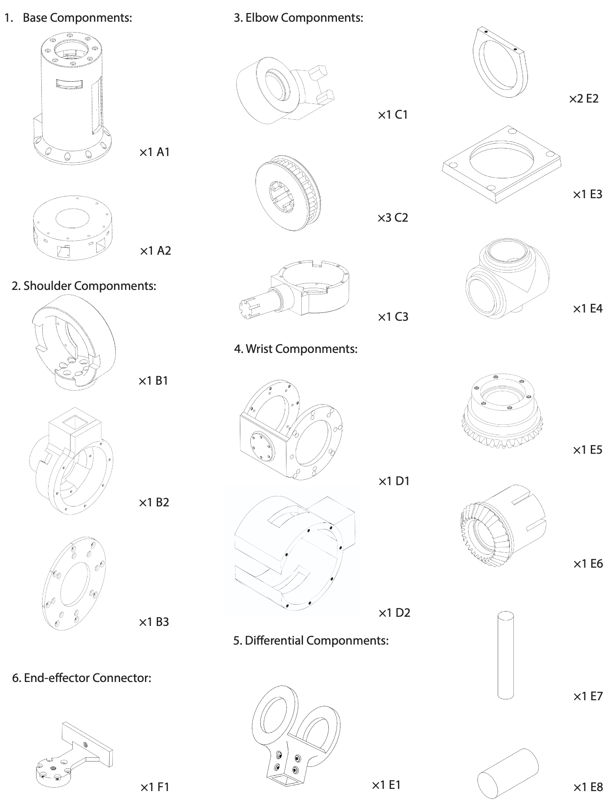
</p>

---

## 🦾 Robot Kinematics

This section documents the **forward kinematics model** of the **IRIS cinema robot arm**, defined using the **standard Denavit–Hartenberg (DH) convention**.
The DH parameters are used consistently across:

- MuJoCo simulation model
- Analytical forward / inverse kinematics solvers
- Jacobian-based control
- Trajectory planning and optimization

All frames follow the **standard DH assignment**:
each joint frame is attached such that the (z_i)-axis aligns with joint (i)'s rotation axis.

---

### 📐 Denavit–Hartenberg Parameters

**Standard DH Convention**

| Joint | Description    | (a_i) (m) | (\alpha_i) (deg) | (d_i) (m) | (\theta_i^{off}) (deg) |
| ----- | -------------- | --------- | ---------------- | --------- | ---------------------- |
| J1    | Base yaw       | 0.0000    | 0.0              | 0.2487    | 0.0                    |
| J2    | Shoulder pitch | 0.0218    | 90.0             | 0.0590    | 180.0                  |
| J3    | Arm pitch      | 0.2998    | 0.0              | 0.0000    | 0.0                    |
| J4    | Elbow pitch    | 0.0200    | 90.0             | 0.0000    | 0.0                    |
| J5    | Wrist pitch    | 0.3251    | -90.0            | 0.0000    | 0.0                    |
| J6    | Wrist roll     | 0.0428    | 90.0             | 0.0000    | 0.0                    |

Where:

- (a_i): link length
- (\alpha_i): link twist
- (d_i): link offset
- (\theta_i^{off}): constant joint angle offset
- Actual joint angle:
  [
  \theta_i = \theta_i^{off} + q_i
  ]

<p align="center">
  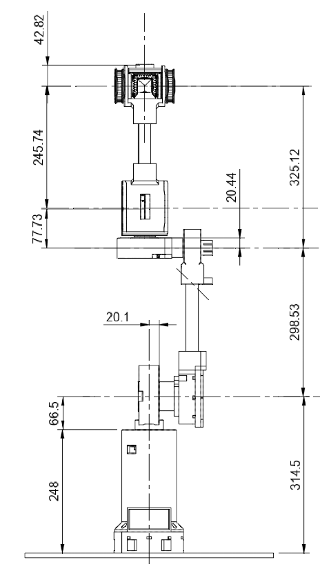
</p>

---

### 🔢 Forward Kinematics

The homogeneous transform from frame (i-1) to frame (i) is:

[
T_i =
\begin{bmatrix}
\cos\theta_i & -\sin\theta_i\cos\alpha_i & \sin\theta_i\sin\alpha_i & a_i\cos\theta_i \
\sin\theta_i & \cos\theta_i\cos\alpha_i & -\cos\theta_i\sin\alpha_i & a_i\sin\theta_i \
0 & \sin\alpha_i & \cos\alpha_i & d_i \
0 & 0 & 0 & 1
\end{bmatrix}
]

The end-effector pose is computed as:

[
T_{0}^{6} = \prod_{i=1}^{6} T_i
]

This transformation is implemented in:

```
mujoco_sim/kinematics/forward_kinematics.py
```

and verified against the MuJoCo model.

---

### 🎯 Workspace

With the above parameters, the arm provides:

- **Maximum reach:** ~1.0 m
- **6-DOF full pose control**
- **Continuous yaw at base**
- **Decoupled wrist for smooth camera orientation**

This kinematic design is optimized for **cinematographic shot composition**, providing long reach and smooth viewpoint control.

---

### 🧩 Inverse Kinematics

Inverse kinematics is solved using:

- Analytical Jacobian-based iterative solver
- Damped least-squares for singularity robustness

Implemented in:

```
mujoco_sim/kinematics/inverse_kinematics.py
```

---

### 🧠 Usage

Compute forward kinematics:

```bash
python mujoco_sim/kinematics/forward_kinematics.py --q 0 0 0 0 0 0
```

Solve inverse kinematics:

```bash
python mujoco_sim/kinematics/inverse_kinematics.py --target_xyz 0.6 0.0 0.5
```

---

### ✅ Model Consistency

The same DH parameters are used for:

- MuJoCo XML model
- ROS TF tree
- Analytical solvers
- Learning-based controllers

This guarantees **consistent sim-to-real kinematic alignment**.

---

## 2️⃣ Low-Level Actuator Control

Low-level torque, velocity, and position control is implemented using the **official Unitree GO-series actuator SDK**.
Motors communicate over **RS-485 at 1 kHz**, enabling synchronized multi-joint closed-loop control with gravity compensation and impedance control.

### 📘 Unitree SDK and Documentation

- **Official Actuator Documentation:**
  [https://support.unitree.com/home/en/Actuator](https://support.unitree.com/home/en/Actuator)

- **Unitree Actuator SDK Repository:**
  [https://github.com/unitreerobotics/unitree_actuator_sdk](https://github.com/unitreerobotics/unitree_actuator_sdk)

Place the SDK at:

```
mpr_control/unitree_actuator_sdk/
```

### ⚙️ Setup

```bash
cd mpr_control/unitree_actuator_sdk/python
pip install -r requirements.txt
```

### ▶️ Example Motor Demos

```bash
python example_goM8010_6_motor.py     # Motor diagnostics
python position_teleop.py             # Joint-space teleoperation
python torque_teleop.py               # Torque control demo
python velocity_teleop.py             # Velocity control demo
```

<p align="center">
  
</p>

---

## 3️⃣ MuJoCo Simulation

A physics-accurate **MuJoCo digital twin** is provided for:

- Kinematic verification
- Classical motion planning (RRT\*, potential fields)
- Trajectory preview
- Real–sim synchronization

### ⚙️ Setup

```bash
cd mujoco_sim
pip install -r requirements.txt
```

### ▶️ Run Simulation Demos

```bash
python circle_path_tracking.py
python line_path_tracking.py
```

<p align="center">
  
  
</p>

```bash
python cinema_line_tracking.py --mode crane
```

<p align="center">
  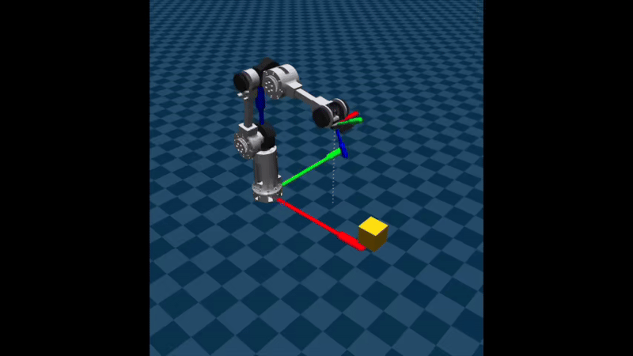
</p>

```bash
python cinema_line_tracking.py --mode dolly
```

<p align="center">
  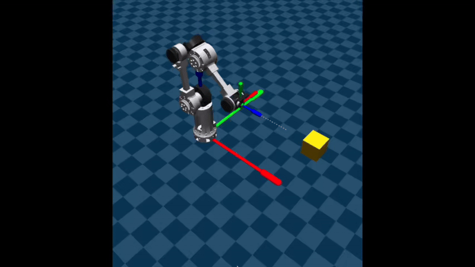
</p>

```bash
python cinema_line_tracking.py --mode pan
```

<p align="center">
  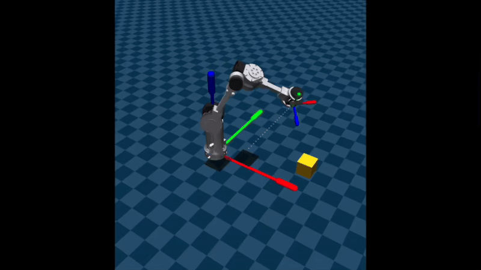
</p>

### ▶️ Interactive Teleoperation

```bash
python teleop_ik.py     # Cartesian IK teleoperation
python teleop_fk.py     # Joint-space teleoperation
```

<p align="center">
  
</p>

---

## 4️⃣ ROS Interface, Hardware Bringup, and Rosbag Collection

The ROS stack provides a unified interface for **real‑robot control, calibration, teleoperation, MuJoCo synchronization, and dataset recording**.
It bridges the Unitree actuator hardware, RealSense RGB‑D sensing, and the MuJoCo digital twin into a single synchronized pipeline.

### 🧩 System Overview

**Core ROS Nodes**

| Node                      | File                        | Role                                                                                                                |
| ------------------------- | --------------------------- | ------------------------------------------------------------------------------------------------------------------- |
| `iris_hw_node`            | `iris_hw_node.py`           | Low‑level hardware driver. Streams Unitree actuator states, executes joint commands, and publishes `/joint_states`. |
| `keyboard_joint_teleop`   | `keyboard_joint_teleop.py`  | Keyboard teleoperation interface publishing `/arm/command`.                                                         |
| `teach_repeat_node`       | `teach_and_repeat.py`       | Kinesthetic teaching and playback of demonstrations.                                                                |
| `joint_state_calibrator`  | `calibrate_joint_states.py` | Converts raw motor states into calibrated kinematic joint states.                                                   |
| `home_calibration_node`   | `calibrate_home_state.py`   | Interactive home pose calibration and offset saving.                                                                |
| `mujoco_state_visualizer` | `mujoco_visualizer.py`      | Real‑to‑sim state synchronization in MuJoCo.                                                                        |

---

### 🚀 Hardware Bringup

Launch the IRIS hardware driver:

```bash
roslaunch unitree_arm_ros iris_bringup.launch
```

This starts:

- Unitree actuator streaming over RS‑485 at 200 Hz
- `/joint_states` publisher
- `/arm/command` subscriber
- Joint‑space impedance control with velocity limiting and safety timeout

**Published Topics**

| Topic           | Type                     | Description                                   |
| --------------- | ------------------------ | --------------------------------------------- |
| `/joint_states` | `sensor_msgs/JointState` | Raw motor‑side joint positions and velocities |

**Subscribed Topics**

| Topic          | Type                     | Description                                   |
| -------------- | ------------------------ | --------------------------------------------- |
| `/arm/command` | `sensor_msgs/JointState` | Desired joint targets from teleop or policies |

---

### 🎮 Keyboard Teleoperation

```bash
roslaunch unitree_arm_ros keyboard_teleop.launch
```

This launches:

- Wait‑for‑state node
- `keyboard_joint_teleop.py`

**Teleop Flow**

```
Keyboard Input → /arm/command → iris_hw_node → Actuators → /joint_states
```

---

### 🏠 Home Pose Calibration

Before first use, define the robot home configuration:

```bash
rosrun unitree_arm_ros calibrate_home_state.py
```

Procedure:

1. Manually place robot in upright home pose
2. Press ENTER in terminal
3. Joint offsets are saved to `config/calibration.yaml`

This file stores motor encoder offsets for repeatable kinematic alignment.

---

### 🧭 Kinematic Joint Calibration

Convert raw motor readings into kinematic joint coordinates:

```bash
rosrun unitree_arm_ros calibrate_joint_states.py
```

This node:

- Subscribes to `/joint_states`
- Applies saved encoder offsets
- Computes differential wrist pitch/roll mapping
- Publishes calibrated `/joint_states_calibrated`

**Calibrated Topics**

| Topic                      | Type                     | Description                                       |
| -------------------------- | ------------------------ | ------------------------------------------------- |
| `/joint_states_calibrated` | `sensor_msgs/JointState` | Kinematic joint states for controllers and MuJoCo |

---

### 🪞 Real → MuJoCo Synchronization

```bash
rosrun unitree_arm_ros mujoco_visualizer.py
```

This node mirrors the real robot configuration into the MuJoCo digital twin:

```
/joint_states → Calibration → MuJoCo qpos → Live Viewer
```

This enables real‑time verification of kinematic consistency and safety before executing learned policies.

<p align="center">
  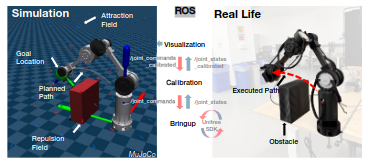
</p>

---

### ✋ Kinesthetic Teaching and Playback

```bash
rosrun unitree_arm_ros teach_and_repeat.py
```

Capabilities:

- Gravity‑compensated hand‑guiding
- High‑rate joint trajectory recording (200 Hz)
- Smooth replay with cosine interpolation
- CSV export for debugging or benchmarking

**Data Flow**

```
/joint_states → teach_and_repeat → CSV log
teach_and_repeat → /arm/command → iris_hw_node
```

---

### 📷 RGB‑D and TF Streaming

The RealSense camera publishes synchronized visual observations:

| Topic                          | Type                     |
| ------------------------------ | ------------------------ |
| `/camera/color/image_raw`      | `sensor_msgs/Image`      |
| `/camera/depth/image_rect_raw` | `sensor_msgs/Image`      |
| `/camera/color/camera_info`    | `sensor_msgs/CameraInfo` |
| `/tf`                          | `tf2_msgs/TFMessage`     |
| `/tf_static`                   | `tf2_msgs/TFMessage`     |

These streams provide timestamp‑aligned perception inputs for imitation learning.

---

### 💾 Rosbag Data Recording

Automated SSD‑backed data collection:

```bash
bash calibrated_data_collection -O NAME
```

Features:

- Records directly to external SSD
- Automatic filename tagging with goal and timestamp
- Automatic bag chunking every 100 s
- LZ4 compression

**Recorded Topics**

```
/arm/command
/joint_states
/tf
/tf_static
/camera/color/image_raw
/camera/color/camera_info
/camera/depth/image_rect_raw
/camera/depth/camera_info
```

Each bag is later converted into episode folders for training.

---

### Human expert data collection demonstrations data collection

<p align="center">
  
</p>

### Semi-autonumous data collection deployment

<p align="center">
  
</p>

---

### 📦 Dataset Output Structure

```
processed_data/<bag_prefix>_episode_0001/
 ├── rgb/                 # RGB frames
 ├── depth/              # Depth frames
 └── robot/joint_states.csv
```

These episodes are directly consumed by the imitation learning pipeline.

---

## 5️⃣ Rosbag Data Processing and Episode Generation

Raw ROS bag recordings are converted into structured, learning-ready episodes using an interactive dataset builder.
This tool aligns RGB-D frames with robot joint states, performs timestamp interpolation, and exports synchronized multimodal trajectories for imitation learning.

---

### 🧠 Processing Pipeline Overview

```
Rosbag (.bag)
 ├── /camera/color/image_raw         → RGB frames
 ├── /camera/depth/image_rect_raw   → Depth frames
 └── /joint_states                 → Robot joint states
        ↓
Temporal alignment (RGB ↔ Depth)
        ↓
Joint-state interpolation at camera timestamps
        ↓
Interactive episode slicing
        ↓
Structured episode folders
```

---

### ⚙️ Running the Dataset Builder

```bash
cd bag_reader/scripts

python process_rosbag.py \
  --bag /media/jerry/SSD/rosbag_data/demo_name_YYYYMMDD_HHMMSS.bag \
  --out /media/jerry/SSD/processed_data
```

This launches an interactive episode editor window.

---

### 🎛 Interactive Episode Cutter Controls

| Key       | Action                    |
| --------- | ------------------------- |
| ← / →     | Move START frame          |
| ↑ / ↓     | Move END frame            |
| **p**     | Playback selected segment |
| **Enter** | Save current episode      |
| **ESC**   | Exit                      |

During preview, the UI displays:

- RGB frames
- Normalized depth frames
- Joint angles at start and end frames

This allows precise trimming of clean demonstration segments.

---

### 🔄 RGB–Depth Temporal Alignment

Because RGB and depth cameras publish asynchronously, the script:

1. Estimates the initial timestamp offset
2. Trims streams to equal length
3. Guarantees one-to-one RGB–Depth correspondence

---

### 📐 Joint-State Interpolation

Robot joint states are typically published at a higher rate than camera frames.
To synchronize modalities, joint positions are interpolated at camera timestamps:

[
\mathbf{q}(t_c) = \mathrm{interp}(t_c, {t_j, \mathbf{q}_j})
]

This ensures each exported image frame has a precisely aligned robot configuration.

---

### 📦 Output Episode Structure

```
processed_data/<bag_prefix>_episode_0001/
 ├── rgb/                  # RGB frames (frame_XXXX.png)
 ├── depth/                # Depth frames (frame_XXXX.png)
 ├── robot/
 │    └── joint_states.csv
 └── meta.json             # Episode timing metadata
```

---

### 📄 joint_states.csv Format

| Column      | Description                 |
| ----------- | --------------------------- |
| timestamp   | Camera frame timestamp      |
| pos_joint_i | Joint positions (rad)       |
| vel_joint_i | Joint velocities (optional) |
| eff_joint_i | Joint efforts (optional)    |

---

### 🧾 meta.json

Each episode also includes metadata:

```json
{
  "start_index": 120,
  "end_index": 360,
  "num_frames": 241,
  "t_start": 1736649201.23,
  "t_end": 1736649205.87
}
```

This allows exact temporal reconstruction for evaluation.

---

## 6️⃣ Imitation Learning

Visuomotor imitation learning is implemented using an **Action‑Conditioned Transformer (ACT)** that predicts short‑horizon future joint trajectories conditioned on RGB observations, robot joint states, and a target goal.

<p align="center">
  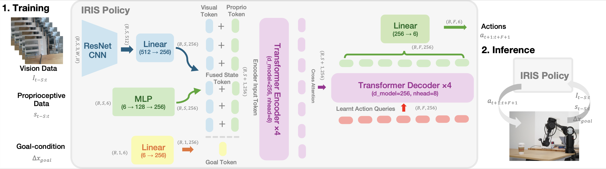
</p>

---

### 🧩 Model Architecture

**Core components**

| Module        | File                          | Description                                                                                 |
| ------------- | ----------------------------- | ------------------------------------------------------------------------------------------- |
| ACT Model     | `models/transformer_model.py` | Action‑Conditioned Transformer with ResNet34 visual encoder and transformer encoder–decoder |
| Loss Function | `losses/loss.py`              | Trajectory reconstruction + continuity + goal consistency loss                              |
| Kinematics    | `kinematics.py`               | Forward kinematics used for Cartesian evaluation                                            |

**Loss formulation**

The training objective combines three terms:

L = L_mse + λ_cont · L_cont + λ_goal · L_goal

Trajectory reconstruction: L*mse = || Δq̂*(1:F) − Δq\_(1:F) ||²
Continuity regularization: L_cont = || Δq̂_1 ||²
Goal consistency: L_goal = || (q_t + Δq̂_F) − q_goal ||²

This encourages smooth initial motion, accurate trajectory imitation, and convergence to the goal configuration.

---

### ⚙️ Dataset Interface

Training windows are loaded using:

`datasets/iris_dataset.py → EpisodeWindowDataset`

Each sample provides:

| Tensor     | Shape               | Description                      |
| ---------- | ------------------- | -------------------------------- |
| rgb        | (B, S, 3, 128, 128) | RGB observation sequence         |
| joints     | (B, S, 6)           | Joint states                     |
| goal_xyz   | (B, 3)              | Cartesian goal position          |
| fut_delta  | (B, F, 6)           | Ground‑truth future joint deltas |
| goal_joint | (B, 6)              | Target joint configuration       |

---

### 🏋️ Training

Train an ACT policy using the main training script:

```bash
cd il_training
python train.py \
  --data_dir /media/jerry/SSD/processed_data \
  --name iris_goal_exp1 \
  --epochs 80 \
  --batch_size 32
```

**Outputs**

```
checkpoints/best_iris_goal_exp1.pth
checkpoints/final_iris_goal_exp1.pth
plots/history_iris_goal_exp1.csv
plots/loss_iris_goal_exp1.png
```

---

### 📊 Training Curves

<p align="center">
  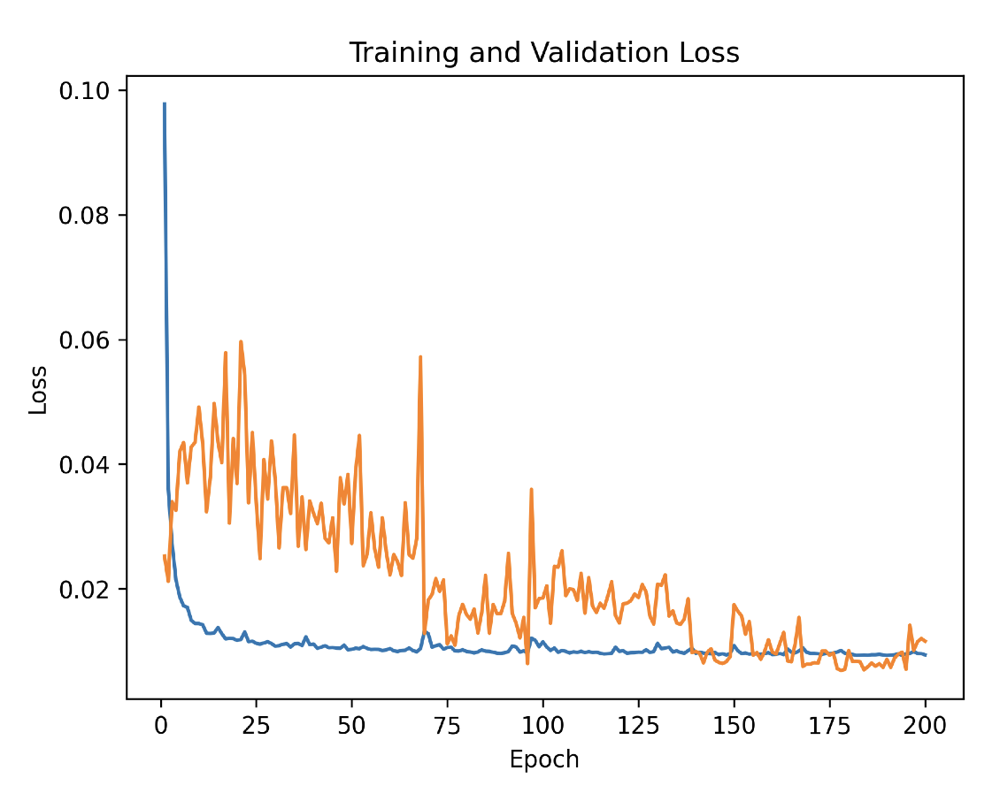
</p>

---

### 🧪 Evaluation

Evaluate a trained model on held‑out test episodes:

```bash
cd il_training
python test.py
```

Evaluation pipeline:

1. Loads trained checkpoint
2. Predicts final joint state
3. Applies forward kinematics
4. Computes Cartesian goal error

---

### 🧾 Configuration Files

Training hyperparameters are defined in:

```
configs/train.yaml
```

Includes model size, training schedule, and loss weights.

---

### 🏁 Summary Pipeline

Processed Episodes → Dataset → ACT Model → ACT Loss → Training → Checkpoints → Evaluation

## 7️⃣ Sim-to-Real Deployment

### ▶️ Quick start for sim2real:

To test out the inverse kinematics, run the following command. The script will compute the joint position using optimization in sim and command the robot via ROS.

```bash
rosrun unitree_arm_ros keyboard_ik_teleop.py
```

<p align="center">
  
</p>

Planned or learned trajectories can be:

- Previewed in MuJoCo
- Executed on the real robot
- Logged via ROS
- Replayed in simulation

### ▶️ Execute Learned Policy

```bash
python il_training/deploymemnt.py --model models/best_act_iris_goal_exp1.pth
```

<p align="center">
  
</p>

---

## 💻 System Requirements

- Python ≥ 3.9
- MuJoCo ≥ 2.3
- ROS Noetic
- Intel RealSense RGB-D camera
- Unitree GO-M8010-6 actuators
- NVIDIA GPU recommended for IL training

---

## 📄 Citation

```
@article{cheng2026iris,
  title={IRIS: Learning-Driven Task-Specific Robot Arm for Visuomotor Motion Control},
  author={Cheng, Qilong and others},
  journal={Under Review},
  year={2026}
}
```

---

## 📧 Contact

**Qilong (Jerry) Cheng**
NYU Robotics
[qc1007@nyu.edu](mailto:qc1007@nyu.edu)
