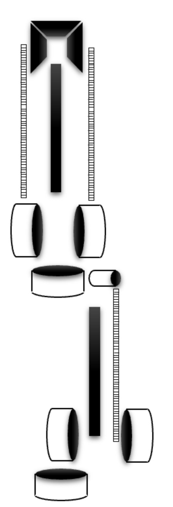
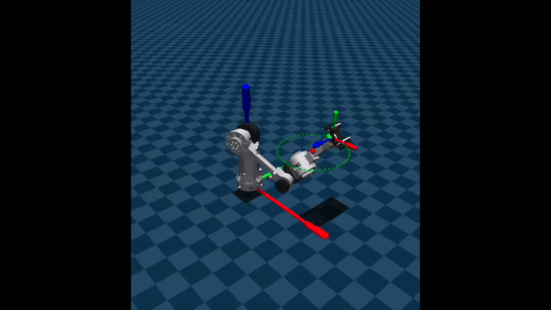
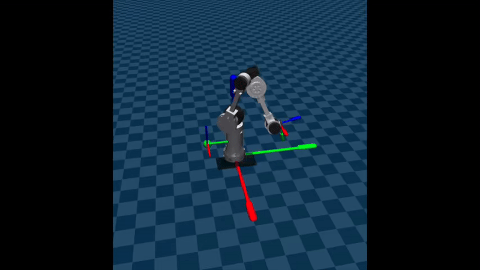
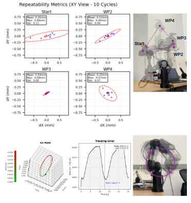
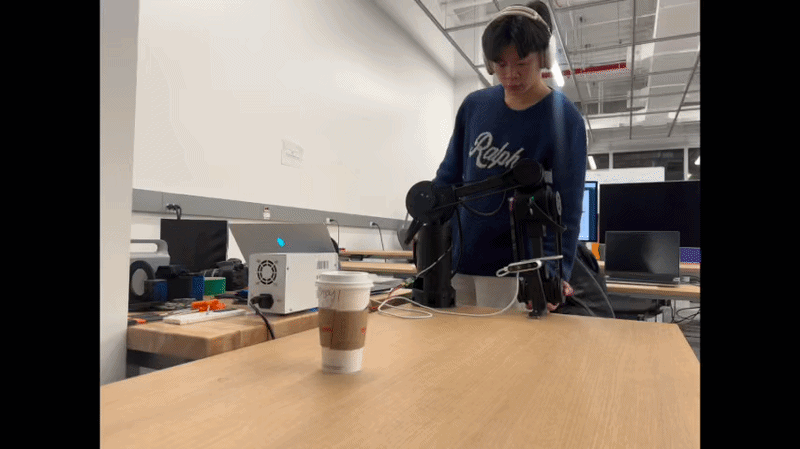
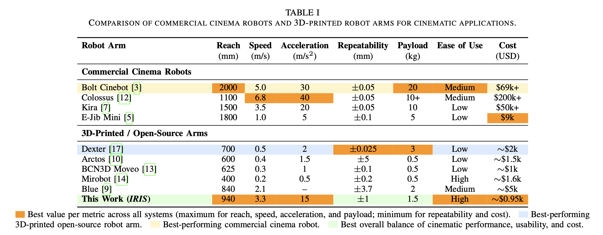

# 🎥 IRIS: Learning-Driven Cinema Robot Arm for Visuomotor Motion Control

<p align="center">
  
</p>

<p align="center">
  
  
  
  
  
  
  
</p>

> **IRIS** (Intelligent Robotic Imaging System) is a low-cost, 3D-printed 6-DOF cinema robot arm that learns cinematic camera motions from human demonstrations via visuomotor imitation learning. This repo contains the **complete hardware, simulation, ROS, data pipeline, and learning stack**.

<p align="center">
  
</p>

---

## 📦 Repository Structure

```
MEng_project/
├── mujoco_sim/          # MuJoCo digital twin, cinema planners, kinematics
├── classical_planner/   # RRT*, Artificial Potential Field planners
├── mpr_control/         # Unitree GO-M8010-6 SDK + low-level RS-485 control
├── meng_ws/             # ROS Noetic workspace (hardware driver, teleop, data collection)
├── bag_reader/          # Rosbag → episode extractor + interactive GUI cutter
├── il_training/         # Imitation learning (CVAE, Transformer, CNN-BC)
│   ├── models/          # Model architectures (CVAE, Det, VanillaBC)
│   ├── datasets/        # Dataset loaders + clip builders
│   ├── losses/          # KL, MSE, smoothness losses
│   └── metrics_compute/ # Offline + live evaluation metrics
├── sim2real/            # Sim–real synchronization utilities
└── images/ & videos/    # Documentation assets
```

---

## ⚡ Quick Start

### Prerequisites

| Requirement | Version |
|---|---|
| Python | ≥ 3.9 |
| MuJoCo | ≥ 2.3 |
| ROS | Noetic |
| CUDA GPU | Recommended (RTX 4090 used for training) |
| Intel RealSense | D435 RGB-D |
| Actuators | Unitree GO-M8010-6 × 6 |

### Install Simulation

```bash
cd mujoco_sim
pip install -r requirement.txt
```

### Install Imitation Learning

```bash
cd il_training
pip install torch torchvision mujoco pandas scipy ultralytics colorama tqdm
```

---

## 1️⃣ Hardware Platform

IRIS is a **fully 3D-printed 6-DOF** camera robot driven by **Unitree GO-M8010-6** torque-controlled BLDC motors. Designed for **backdrivability** — enabling kinesthetic teaching (hand-guided demonstrations).

<p align="center">
  
  
</p>

<details>
<summary><b>📋 Bill of Materials (~$992 USD total)</b></summary>

| Category | Item | Qty | Unit (USD) |
|---|---|---|---|
| **Actuators** | Unitree Go-M8010-6 | 6 | $69.65 |
| **Linkages** | Carbon fiber tube 25×2mm, 500mm | 1 | $27.40 |
| **Bearings** | 26×17×5 mm | 2 | $1.59 |
| | 50×40×6 mm | 6 | $2.61 |
| | 42×30×7 mm | 5 | $2.43 |
| **Transmission** | HTD-5M belt 150T (750mm) | 1 | $15.19 |
| | HTD-5M belt 160T (800mm) | 2 | $15.56 |
| **Fasteners** | M4 + M3.5 screw sets | 2 | $27.04 |
| **Sensors** | Intel RealSense D435 | 1 | $163.63 |
| **Compute** | NVIDIA Jetson Nano | 1 | $216.15 |
| **Electronics** | RS-485 Hub, Power Supply (≥300W) | — | $35.96 |
| **3D Printing** | PLA (30% infill, BambuLab) | 1 | $16.99 |
| **Misc** | Wire sleeving | 1 | $9.26 |
| | **Total** | | **~$992** |

</details>

<p align="center">
  
</p>

---

## 🦾 Robot Kinematics

DH parameters used **consistently** across MuJoCo XML, ROS TF, analytical solvers, and learning controllers — guaranteeing sim-to-real alignment.

<p align="center">
  
</p>

| Joint | Description | aᵢ (m) | αᵢ (°) | dᵢ (m) | θ_off (°) |
|---|---|---|---|---|---|
| J1 | Base yaw | 0.0000 | 0.0 | 0.2487 | 0.0 |
| J2 | Shoulder pitch | 0.0218 | 90.0 | 0.0590 | 180.0 |
| J3 | Arm pitch | 0.2998 | 0.0 | 0.0000 | 0.0 |
| J4 | Elbow pitch | 0.0200 | 90.0 | 0.0000 | 0.0 |
| J5 | Wrist pitch | 0.3251 | -90.0 | 0.0000 | 0.0 |
| J6 | Wrist roll | 0.0428 | 90.0 | 0.0000 | 0.0 |

**Max reach:** ~1.0 m &nbsp;|&nbsp; **Full 6-DOF pose control** &nbsp;|&nbsp; **Continuous base yaw**

```bash
# Forward kinematics
python mujoco_sim/forward_kinematics.py --q 0 0 0 0 0 0

# Inverse kinematics (damped least-squares)
python mujoco_sim/inverse_kinematics_numerical.py --target_xyz 0.6 0.0 0.5
```

---

## 2️⃣ Low-Level Actuator Control

6 motors communicate over **RS-485 at 1 kHz** with torque/velocity/position control via the Unitree SDK.

```bash
cd mpr_control/unitree_actuator_sdk/python

python example_goM8010_6_motor.py    # Motor diagnostics
python position_teleop.py             # Joint-space position control
python torque_teleop.py               # Direct torque control
python velocity_teleop.py             # Velocity control
```

<p align="center">
  
</p>

**Repeatability test** — same trajectory executed 5× back-to-back:

<p align="center">
  
</p>

---

## 3️⃣ MuJoCo Simulation

Physics-accurate digital twin used for kinematic verification, classical planning, trajectory preview, and real→sim mirroring.

```bash
cd mujoco_sim
```

### 🎬 Cinema Shot Modes

```bash
python cinema_line_tracking.py --mode crane    # Vertical rise/descend
python cinema_line_tracking.py --mode dolly    # Push in / pull out
python cinema_line_tracking.py --mode pan      # Lateral arc sweep
```

<p align="center">
  
  
  
</p>

### 🔵 Circular Path Tracking

```bash
python circle_path_tracking.py --radius 0.15 --center 0.45 0.0 0.4
```

<p align="center">
  
</p>

### 🟢 Point Tracking

```bash
python point_tracking.py
```

<p align="center">
  
</p>

### 🎮 Interactive Teleoperation

```bash
python teleop_ik.py    # Cartesian IK control
python teleop_fk.py    # Joint-space FK control
```

### 🧠 Classical Planners

```bash
# Artificial Potential Field
python path_tracking.py

# RRT* with obstacle avoidance
cd classical_planner
python rrt.py
```

<p align="center">
  
  
</p>

---

## 4️⃣ ROS Interface & Hardware

<p align="center">
  
</p>

### 🧩 ROS Nodes

| Node | Script | Role |
|---|---|---|
| `iris_hw_node` | `iris_hw_node.py` | RS-485 driver, 200 Hz, `/joint_states` pub, `/arm/command` sub |
| `calibrate_joint_states` | `calibrate_joint_states_node.py` | Encoder offsets + differential wrist mapping → `/joint_states_calibrated` |
| `calibrate_home_pose` | `calibrate_home_pose.py` | Interactive home pose setup, saves `calibration.yaml` |
| `keyboard_joint_teleop` | `keyboard_joint_teleop.py` | Keyboard → `/arm/command` (joint-space) |
| `keyboard_ik_teleop` | `keyboard_ik_teleop.py` | Keyboard → `/arm/command` (Cartesian IK) |
| `teach_and_repeat` | `teach_and_repeat_node.py` | Gravity-compensated recording + cosine replay at 200 Hz |
| `mujoco_visualizer` | `mujoco_visualizer_calibrated.py` | Real robot → MuJoCo live mirror |

### 🚀 Hardware Bringup

```bash
# 1. Start ROS master
roscore

# 2. Launch hardware driver (200 Hz RS-485, joint states, safety watchdog)
roslaunch unitree_arm_ros iris_bringup.launch
```

**Topics:**

| Topic | Direction | Description |
|---|---|---|
| `/joint_states` | Published | Raw motor-side positions & velocities |
| `/joint_states_calibrated` | Published | Kinematic-frame joint states |
| `/arm/command` | Subscribed | Target joint positions |

### 🏠 First-Time Calibration

```bash
# Step 1: Home pose — manually place arm upright, then press Enter
rosrun unitree_arm_ros calibrate_home_pose.py
# → Saves offsets to: config/calibration.yaml

# Step 2: Run calibration relay (applies offsets + wrist mapping)
rosrun unitree_arm_ros calibrate_joint_states_node.py
```

### 🎮 Teleoperation

```bash
# Joint-space keyboard teleop
roslaunch unitree_arm_ros keyboard_teleop.launch

# Cartesian IK teleop
rosrun unitree_arm_ros keyboard_ik_teleop.py
```

<p align="center">
  
  
</p>

### ✋ Kinesthetic Teaching & Playback

```bash
rosrun unitree_arm_ros teach_and_repeat_node.py
```

- Records at **200 Hz** with gravity compensation
- Replay uses **cosine interpolation** for smooth transitions
- Exports CSV for debugging / benchmarking

<p align="center">
  
</p>

### 🪞 Real → MuJoCo Live Mirror

```bash
rosrun unitree_arm_ros mujoco_visualizer_calibrated.py
```

<p align="center">
  
</p>

---

## 5️⃣ Data Collection

### Expert Demonstrations

Human physically guides the arm while the system records at 200 Hz.

<p align="center">
  
</p>

```bash
# Starts calibration relay + rosbag recording to external SSD
# LZ4 compressed, auto-chunked every 100s
cd meng_ws/src/unitree_arm_ros/scripts
bash calibrated_data_collection.sh -O <session_name>
```

**Recorded topics:** `/arm/command`, `/joint_states_calibrated`, `/tf`, `/tf_static`, `/camera/color/image_raw`, `/camera/depth/image_rect_raw`, camera info + extrinsics.

### Semi-Autonomous Collection

<p align="center">
  
</p>

---

## 6️⃣ Rosbag → Episode Processing

Raw bags → structured training episodes via an **interactive GUI cutter**.

```bash
cd bag_reader
python gui_process.py \
  --bag /media/jerry/SSD/rosbag_data/<session>.bag \
  --out /media/jerry/SSD/processed_data
```

**GUI Controls:**

| Key | Action |
|---|---|
| `←` / `→` | Move **START** frame |
| `↑` / `↓` | Move **END** frame |
| `p` | Preview selected segment |
| `Enter` | Save episode |
| `ESC` | Exit |

<p align="center">
  
</p>

**What it does:**
- Aligns RGB + depth timestamps (offset estimation + trim to 1:1)
- Interpolates joint states at camera frame timestamps
- Exports numbered episode folders

**Output structure:**

```
processed_data/<session>_episode_0001/
├── rgb/           frame_XXXX.png
├── depth/         frame_XXXX.png
├── robot/         joint_states.csv   # timestamp, pos_joint_0..5
└── meta.json      # start_index, end_index, num_frames, t_start, t_end
```

<p align="center">
  
</p>

---

## 7️⃣ Dataset Preparation

Convert episodes into training clips (sliding window format):

```bash
cd il_training

# Step 1: Build clips (SEQ=8 input frames, FUTURE=15 target steps)
python datasets/build_dataset.py \
  --root /media/jerry/SSD/processed_data \
  --prefix <session_name> \
  --out ~/Desktop/final_RGB_joint_goal

# Step 2: Resize all images to 224×224 in-place (run once)
python datasets/resize_dataset.py \
  --root_dir ~/Desktop/final_RGB_joint_goal \
  --num_workers 8
```

Each training clip contains:

| Data | Shape | Description |
|---|---|---|
| `rgb/input_XXXX.png` | 8 × (3, 224, 224) | RGB observation sequence |
| `rgb/goal.png` | (3, 224, 224) | Target frame (last episode image) |
| `robot/data.json` | — | Joint history (8×6) + future targets (15×6) |

---

## 8️⃣ Imitation Learning Training

<p align="center">
  
</p>

Three architectures × three input modalities = **9 ablation variants**.

### Model Variants

| Key | Architecture | Inputs |
|---|---|---|
| `cvae_rgb` | CVAE + Transformer | RGB sequence |
| `cvae_visual` | CVAE + Transformer | RGB + goal image |
| **`cvae_full`** ⭐ | **CVAE + Transformer** | **RGB + goal + joint history** |
| `det_rgb` | Deterministic Transformer | RGB sequence |
| `det_visual` | Deterministic Transformer | RGB + goal image |
| `det_full` | Deterministic Transformer | RGB + goal + joint history |
| `vanilla_bc` | ResNet34 + MLP | RGB + goal + joint history |

> ✨ **Auto-resume:** All training scripts auto-resume from the last checkpoint — just re-run the same command.

---

### CVAE Models (Primary — Best Performance)

**Loss:** MSE + β·KL + λ·Smoothness &nbsp;|&nbsp; β=0.01, SEQ=8, FUTURE=15, latent_dim=32

```bash
cd il_training

# Full context (recommended)
python train_cvae.py \
  --name cvae_full_v1 \
  --model cvae_full \
  --loss loss_kl \
  --data_roots ~/Desktop/final_RGB_joint_goal \
  --checkpoint_dir ~/Desktop/checkpoints \
  --batch_size 64 --num_workers 8 --epochs 100 \
  --latent_dim 32 --beta 0.01

# Visual servoing (RGB + goal only)
python train_cvae.py \
  --name cvae_visual_v1 --model cvae_visual \
  --loss loss_kl --data_roots ~/Desktop/final_RGB_goal \
  --checkpoint_dir ~/Desktop/checkpoints \
  --batch_size 64 --epochs 100

# RGB only (ablation)
python train_cvae.py \
  --name cvae_rgb_v1 --model cvae_rgb \
  --loss loss_kl --data_roots ~/Desktop/final_RGB_only \
  --checkpoint_dir ~/Desktop/checkpoints \
  --batch_size 64 --epochs 100
```

<p align="center">
  
</p>

---

### Deterministic Transformer (Baseline)

**Loss:** MSE + Smoothness

```bash
python train_determinstic.py \
  --name det_full_v1 \
  --model det_full \
  --loss mse_smooth \
  --data_roots ~/Desktop/final_RGB_joint_goal \
  --checkpoint_dir ~/Desktop/checkpoints \
  --batch_size 128 --num_workers 8 --epochs 100
```

---

### CNN Behavior Cloning (Baseline)

**Loss:** MSE &nbsp;|&nbsp; Backbone: ResNet34 + MLP

```bash
python train_cnn_bc.py \
  --name vanilla_bc_v1 \
  --data_roots ~/Desktop/final_RGB_joint_goal \
  --checkpoint_dir ~/Desktop/checkpoints \
  --batch_size 64 --num_workers 8 --epochs 100
```

---

### Fine-tuning / Continue Training

```bash
python continue_train.py \
  --name iris_cvae_finetune_v1 \
  --model transformer_cvae \
  --loss loss_kl \
  --data_roots /media/jerry/SSD/new_data \
  --checkpoint_dir ~/Desktop/checkpoints \
  --batch_size 32 --epochs 200
```

### Output Files

```
~/Desktop/checkpoints/
├── best_<name>.pth      ← best validation checkpoint (use this for deployment)
├── latest_<name>.pth    ← most recent checkpoint (auto-resume target)
└── plots/
    ├── loss_<name>.png  ← train/val loss curve
    └── loss_<name>.csv  ← raw history
```

---

## 9️⃣ Offline Evaluation

Evaluate on held-out test data before touching the robot:

```bash
cd il_training

# Compute MSE + KL metrics on test split
python metrics_compute/metrics_test.py \
  --test_data ~/Desktop/final_RGB_joint_goal/test \
  --checkpoint ~/Desktop/checkpoints/best_cvae_full_v1.pth \
  --model_type cvae_full

# Full offline benchmark: Visual Alignment, Jerk, Framing Error, SRR
python metrics_compute/offline_metric_logger.py \
  --root /path/to/recorded_policy_episodes \
  --goal /path/to/goal_image.png \
  --xml ~/Desktop/MEng_project/mujoco_sim/assets/iris.xml \
  --num 10
```

**Offline metrics output:**

```
[Ep 001] Vis: 0.962 | Status: SUCCESS | Jerk: 0.82 | Len: 0.65m
[Ep 002] Vis: 0.720 | Status: FAIL    | Jerk: 4.50 | Len: 0.10m
```

---

## 🔟 Deployment (Sim-to-Real)

<p align="center">
  
</p>

### Run CVAE Policy (Best Performance)

```bash
cd il_training

# CVAE full — real robot
python policy_cvae.py \
  --model_type cvae_full \
  --checkpoint ~/Desktop/checkpoints/best_cvae_full_v1.pth \
  --goal_dir ~/Desktop/goal_images \
  --device cuda

# CVAE full — simulation only
python policy_cvae.py \
  --model_type cvae_full \
  --checkpoint ~/Desktop/checkpoints/best_cvae_full_v1.pth \
  --goal_dir ~/Desktop/goal_images \
  --device cuda --sim
```

### Run CNN-BC Policy (Baseline)

```bash
python policy_cnn.py \
  --checkpoint ~/Desktop/checkpoints/best_vanilla_bc_v1.pth \
  --goal_dir ~/Desktop/goal_images \
  --device cuda
```

### Runtime Flags

| Flag | Description |
|---|---|
| `--model_type` | Must match training key (`cvae_full`, `det_rgb`, `vanilla_bc`, …) |
| `--goal_dir` | Folder containing goal image(s) (`goal.png`, `goal2.png`, …) |
| `--device cuda` | Use GPU inference |
| `--sim` | Run in MuJoCo simulation instead of real robot |

**Safety parameters (in `policy_cvae.py`):**

| Parameter | Default | Description |
|---|---|---|
| `CONTROL_HZ` | 10 Hz | Inference rate |
| `MAX_STEP_RADIANS` | 0.2 rad | Max per-step joint change |
| `EMA_ALPHA` | 0.3 | Smoothing (0 = heavy, 1 = none) |
| `LOOKAHEAD_STEPS` | 1 | Which step in the 15-step prediction to execute |

<p align="center">
  
</p>

---

## 📊 Results & Metrics

### Aggregate Results

| Method | N | Success Rate | Vis. Alignment | Avg Jerk (m/s³) | SRR |
|---|---|:---:|:---:|:---:|:---:|
| **Expert (Human)** | 10 | **90.0%** | **0.874** | 3.64 | 67.1% |
| **CVAE Full** ⭐ | 13 | **46.2%** | **0.847** | **0.61** | 32.7% |
| Incremental | 6 | 0.0% | 0.636 | 0.83 | 35.2% |
| RGB Only | 3 | 0.0% | 0.584 | 1.65 | 7.2% |
| Visual (no joints) | 4 | 0.0% | 0.536 | 1.59 | 7.3% |
| RRT* | 4 | 0.0% | 0.636 | 0.22 | 10.5% |

> **Key insight:** CVAE Full achieves 97% of expert visual alignment (0.847 vs 0.874) and is **6× smoother** than the human expert (jerk: 0.61 vs 3.64 m/s³).

<p align="center">
  
</p>

### Metric Definitions

| Metric | Description |
|---|---|
| **Visual Alignment** | ResNet18 cosine similarity between current frame and goal image (0→1) |
| **Success Rate** | % of episodes where visual alignment > 0.85 at trajectory end |
| **Cartesian Jerk** | Mean 3rd derivative of end-effector position (m/s³) — lower is smoother |
| **Framing Error** | Pixel-level offset from target composition |
| **SRR** | Shot Repeatability Rate — % of trajectory within acceptable zone |

### Generate Summary Table

```bash
cd il_training/metrics_compute

# Aggregates all *metrics.csv files in current folder
python summarize_metrics.py --root . --output summary_results.csv
```

---

## 🔬 Robustness Testing

Zero-shot initial condition tests — arm placed outside training distribution. Policy demonstrates visual recovery, especially toward end of trajectory.

<p align="center">
  
</p>

---

## 📐 System Architecture

```
┌─────────────────────────────────────────────────────────────────┐
│                        IRIS Full Stack                          │
├──────────────┬──────────────┬──────────────┬────────────────────┤
│  Hardware    │   ROS Stack  │  Data        │  Learning          │
│              │              │              │                    │
│ 6× Unitree   │ iris_hw_node │ Kinesthetic  │ CVAE Transformer   │
│ GO-M8010-6   │  (200 Hz)    │  Teaching    │ ResNet18 backbone  │
│ RS-485 bus   │              │     ↓        │ Spatial Softmax    │
│              │ calibrate_   │ Rosbag       │ Latent dim = 32    │
│ RealSense    │ joint_states │     ↓        │ SEQ=8, FUTURE=15   │
│ D435 RGB-D   │              │ gui_process  │ d_model=256        │
│              │ teach_and_   │     ↓        │ 4 enc + 4 dec      │
│ Jetson Nano  │ repeat_node  │ build_dataset│ 8 attention heads  │
│              │              │     ↓        │                    │
│              │ policy_cvae  │ IRISClipData │ Loss: MSE+KL+Smooth│
└──────────────┴──────────────┴──────────────┴────────────────────┘
```

---

## 📄 License

This project is licensed under the **Creative Commons Attribution-NonCommercial 4.0 International (CC BY-NC 4.0)** license.

- ✅ Free to use, share, and adapt for **non-commercial** purposes with attribution
- ❌ Commercial use requires explicit permission
- 📩 **Business / manufacturing inquiries:** [qc1007@nyu.edu](mailto:qc1007@nyu.edu)

Full license text: [LICENSE](LICENSE) · [CC BY-NC 4.0](https://creativecommons.org/licenses/by-nc/4.0/)

---

## 📄 Citation

```bibtex
@inproceedings{cheng2026iris,
  title     = {{IRIS}: Learning-Driven Task-Specific Cinema Robot Arm for Visuomotor Motion Control},
  author    = {Qilong Cheng and Matthew Mackay and Ali Bereyhi},
  booktitle = {23rd Conference on Robots and Vision},
  year      = {2026},
  url       = {https://openreview.net/forum?id=j7NuiOgKn3}
}
```

---

## 📧 Contact

**Qilong (Jerry) Cheng** — NYU Robotics  
[qc1007@nyu.edu](mailto:qc1007@nyu.edu)
